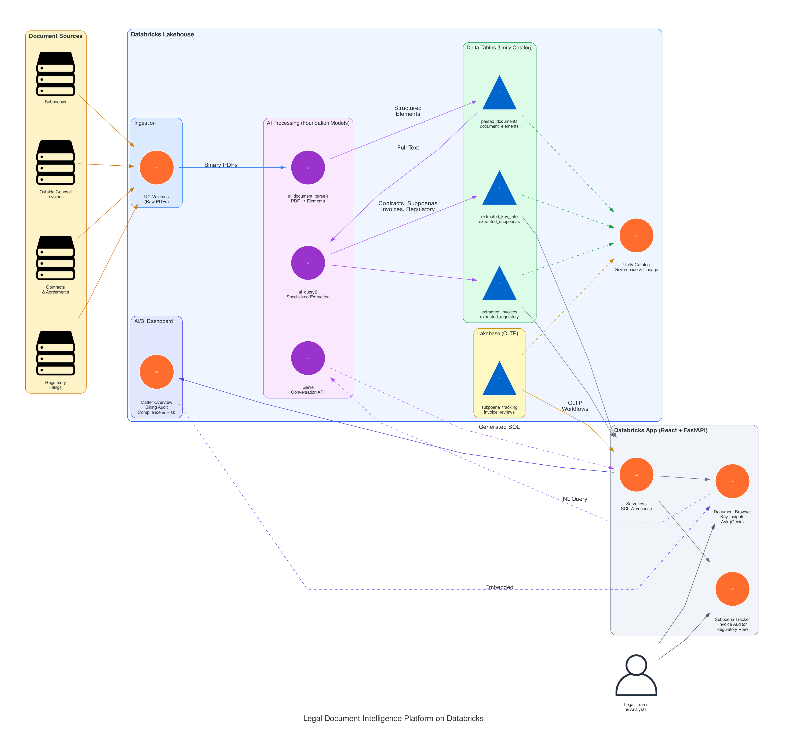

# Legal Document Intelligence Platform on Databricks

An end-to-end demo for processing, parsing, and extracting structured insights from legal documents at scale using Databricks AI Functions (`ai_document_parse`, `ai_query`), Unity Catalog, and Databricks Apps.

**Live App**: [legal-doc-processor](https://legal-doc-processor-7474657121703767.aws.databricksapps.com)

## Architecture



### Pipeline Overview

```
Document Sources           AI Processing                  Structured Storage              Application
 (Subpoenas,        -->   ai_document_parse()     -->    parsed_documents (Delta)    --> Databricks App
  Invoices,                ai_query(Claude)               document_elements                (React + FastAPI)
  Contracts,               Text-to-SQL                    extracted_key_info
  Regulatory)                                                  |
      |                                                   Unity Catalog
 UC Volumes                                              (Governance, Lineage,
 (Raw PDFs)                                               Access Control)
```

1. **Ingest**: PDFs land in Unity Catalog Volumes from any source
2. **Parse**: `ai_document_parse()` extracts structured elements (titles, headers, text, tables) with bounding boxes
3. **Extract**: `ai_query()` with Foundation Models pulls structured fields: parties, dates, dollar amounts, governing law, obligations, risk flags
4. **Store**: All data in governed Delta tables with full lineage
5. **Serve**: Databricks App provides document browsing, key insights, natural language Q&A, search, upload, and analytics

## Solving Real Legal Operations Pain Points

This platform directly addresses three high-value automation opportunities in legal departments:

### 1. Reducing Outside Counsel Spend

**The Problem**: Legal departments struggle to enforce billing guidelines at scale. Outside counsel invoices contain narrative time entries that can be "funky" — block-billed, vaguely described, or non-compliant with agreed-upon billing rules. Manual review of thousands of invoices is cost-prohibitive.

**How This Platform Solves It**:

- **Invoice Parsing**: `ai_document_parse()` ingests outside counsel invoices (PDF/DOCX) and extracts structured line items — timekeeper, hours, rate, task description, and amount
- **AI-Powered Compliance Checking**: `ai_query()` analyzes each line item against configurable billing rules:
  - Flag block-billed entries (multiple tasks in one time entry)
  - Identify excessive research hours relative to matter complexity
  - Detect rates exceeding negotiated caps
  - Spot duplicate or overlapping charges across timekeepers
  - Flag vague descriptions ("Review documents" with no specificity)
- **Spend Analytics**: Delta tables enable cross-firm, cross-matter spend analysis — identify which firms consistently overbill, which matter types have the highest cost variance, and where renegotiation has the most leverage
- **Scale**: Process thousands of invoices per batch run. What previously required a team of billing analysts can run as a scheduled Databricks Job

**Example Query in the Ask page**: *"Show me all invoices where hourly rates exceed $500 and descriptions contain fewer than 10 words"*

### 2. Cutting Manual Legal Ops Work (Subpoena Automation)

**The Problem**: Subpoenas arrive as large PDFs with email attachments. Legal ops teams must manually extract required metadata — responding party, requesting party, data custodians, date ranges, document categories, production deadlines, court jurisdiction, case numbers — to initiate downstream processing. This metadata feeds into case management systems to trigger review workflows. At scale, this manual extraction consumes **thousands of hours annually**.

**How This Platform Solves It**:

- **Automated Intake**: PDFs drop into a UC Volume (via email integration, SFTP, or API upload through the app)
- **Document Parsing**: `ai_document_parse()` extracts all text with structural awareness — it knows the difference between a court header, party names, and the body of the subpoena
- **Metadata Extraction**: `ai_query()` with a subpoena-specific schema extracts:
  ```
  case_number, court_jurisdiction, requesting_party, responding_party,
  data_custodians[], date_range_start, date_range_end,
  document_categories_requested[], production_deadline,
  preservation_requirements, special_instructions
  ```
- **Downstream Integration**: Extracted fields populate the `extracted_key_info` table, which can feed any case management system via API or Databricks workflows
- **Natural Language Access**: Legal ops staff use the Ask page to query: *"Which subpoenas have production deadlines in the next 30 days?"* or *"List all subpoenas requesting data from custodian John Smith"*

**Impact**: Automating subpoena intake at this level converts thousands of hours of manual extraction into minutes of compute time per batch.

### 3. Scraping & Normalizing Regulatory Data

**The Problem**: Legal and compliance teams manually gather data from government and regulatory websites (SEC EDGAR, CFPB, OCC, state AG offices, federal registers). The pain isn't fetching the data — web scraping is mature technology. The pain is **normalizing and structuring it reliably** for downstream use. Raw scraped content is inconsistent, poorly formatted, and requires significant manual cleanup.

**How This Platform Solves It**:

- **Automated Ingestion**: Databricks Jobs schedule periodic scrapes of regulatory sources, downloading filings, rulings, and notices as PDFs/HTML
- **AI-Powered Normalization**: `ai_document_parse()` handles the structural extraction regardless of source format inconsistencies. Whether it's a PDF from the SEC or an HTML page from a state AG, the output is the same: structured elements with type classification
- **Structured Extraction**: `ai_query()` normalizes extracted content into a consistent schema:
  ```
  regulation_id, issuing_agency, effective_date, affected_entities[],
  compliance_requirements[], penalties, comment_period_deadline,
  related_regulations[], summary
  ```
- **Cross-Source Analytics**: Because everything lands in the same Delta table schema, analysts can query across agencies: *"Show all new regulations from the last 90 days affecting consumer lending"*
- **Quality Assurance**: The AI cleans and normalizes data to a quality level that manual processes struggle to achieve consistently — handling variations in date formats, entity naming, jurisdictional references, and regulatory citation styles

**Why AI matters here**: Web scraping gets the bytes. `ai_document_parse()` + `ai_query()` turn inconsistent bytes into reliable, structured, queryable data — the delta between "we have the data" and "we can use the data."

## App Features

| Page | Description |
|------|-------------|
| **Overview** | Landing page with architecture explanation, pipeline diagram, and feature descriptions |
| **Documents** | Browse all 55 parsed documents with element breakdowns (titles, headers, text blocks) |
| **Key Insights** | AI-extracted structured fields — parties, dates, financial terms, governing law, obligations, risk flags |
| **Ask** | Natural language Q&A (Genie-style) — ask questions, get AI-generated SQL + results |
| **Search** | Full-text search across all document content with highlighted matches |
| **Upload** | Drag-and-drop PDF upload with automatic parsing pipeline |
| **Analytics** | Document statistics, element type distribution, and comparison charts |

## Observability with MLflow Tracing

Every AI function call in the pipeline can be instrumented with **MLflow Tracing** for full observability:

- **ai_document_parse() traces**: Track parsing latency per document, element counts, error rates, and page-level quality metrics
- **ai_query() traces**: Log the full prompt, model response, token usage, and latency for each extraction — essential for auditing AI-generated legal conclusions
- **Text-to-SQL traces**: Capture the natural language question, generated SQL, execution time, and result row counts — critical for understanding query accuracy and debugging incorrect translations
- **End-to-end spans**: A single document's journey from upload through parsing to extraction is captured as a linked trace, enabling root cause analysis when extraction quality degrades

MLflow Tracing provides:
- **Cost tracking**: Token usage per document and per extraction type — understand AI spend by document category
- **Quality monitoring**: Track extraction accuracy over time, flag drift in model outputs
- **Compliance audit trail**: Every AI decision is logged — which model, what prompt, what output — satisfying regulatory requirements for AI governance in legal workflows
- **Latency profiling**: Identify bottlenecks in the pipeline (is parsing or extraction the slow step?)

Traces are stored in Unity Catalog and queryable via SQL, enabling dashboards that show AI pipeline health alongside document processing metrics.

## Databricks Components Used

| Component | Purpose |
|-----------|---------|
| `ai_document_parse()` | PDF → structured elements (titles, headers, text, tables, figures) |
| `ai_query()` | Key info extraction + text-to-SQL via Foundation Models |
| Unity Catalog | Data governance, access control, lineage tracking |
| UC Volumes | Managed storage for raw PDF documents |
| Delta Tables | Versioned, ACID-compliant storage for all parsed/extracted data |
| SQL Warehouse (Serverless) | Query execution for the app and analytics |
| Lakebase (OLTP) | Operational workflows — subpoena tracking, invoice reviews |
| Genie Conversation API | Natural language Q&A over legal document tables |
| AI/BI Dashboards | Embedded analytics — matter overview, billing audit, compliance tracking |
| Databricks Apps | Hosted React + FastAPI application |
| Databricks Jobs | Batch processing pipeline for document ingestion |
| MLflow Tracing | AI call observability, cost tracking, compliance audit trail |
| Databricks Asset Bundles | Infrastructure-as-code deployment |

## Quick Start

### Prerequisites
- Databricks workspace in `us-east-1` or `us-west-2` (for AI Functions)
- Databricks CLI configured
- A serverless SQL warehouse
- Node.js 18+ (for frontend build)

### Deploy

```bash
# Clone
git clone https://github.com/maksim-nikiforov_data/legal-doc-processing-demo.git
cd legal-doc-processing-demo

# Build frontend
cd app/frontend && npm install && npm run build && cd ../..

# Configure for your workspace
databricks bundle validate \
  --var="catalog=your_catalog" \
  --var="schema=legal_docs" \
  --var="warehouse_id=your_warehouse_id"

# Deploy infrastructure
databricks bundle deploy

# Run the data pipeline (generates 55 sample docs, parses, extracts)
databricks bundle run setup_legal_docs

# Deploy the app
databricks bundle run legal_doc_processor
```

### Grant App Access

After deployment, grant the app's service principal access to the data:

```sql
-- Replace <sp_client_id> with the service principal client ID from:
-- databricks apps get legal-doc-processor
GRANT USE CATALOG ON CATALOG your_catalog TO `<sp_client_id>`;
GRANT USE SCHEMA, SELECT, MODIFY ON SCHEMA your_catalog.legal_docs TO `<sp_client_id>`;
GRANT READ VOLUME, WRITE VOLUME ON VOLUME your_catalog.legal_docs.raw_documents TO `<sp_client_id>`;
```

## Data Model

### `parsed_documents`
Raw output from `ai_document_parse()` — one row per PDF with VARIANT column containing pages, elements, bounding boxes, and metadata.

### `document_elements`
Flattened elements table — one row per element (title, section_header, text, table, etc.) with document linkage.

| Column | Type | Description |
|--------|------|-------------|
| file_name | STRING | Source PDF filename |
| doc_id | STRING | Document UUID |
| element_id | INT | Element order within document |
| element_type | STRING | title, section_header, text, page_header, table, figure |
| content | STRING | Extracted text content |

### `extracted_key_info`
AI-extracted structured fields — one row per document.

| Column | Type | Description |
|--------|------|-------------|
| file_name | STRING | Source PDF filename |
| document_type | STRING | NDA, Software License, Employment Agreement, etc. |
| parties | STRING (JSON) | Array of party names |
| effective_date | STRING | Agreement effective date |
| termination_date | STRING | Agreement end date |
| governing_law | STRING | Jurisdiction |
| key_dollar_amounts | STRING (JSON) | Array of {description, amount} |
| confidentiality_period | STRING | Duration of confidentiality obligations |
| termination_notice_period | STRING | Required notice for termination |
| non_compete_duration | STRING | Non-compete clause length |
| key_obligations | STRING (JSON) | Array of key terms |
| risk_flags | STRING (JSON) | Array of flagged risky clauses |

## Project Structure

```
legal-doc-processing-demo/
  databricks.yml                    # DAB configuration
  notebooks/
    01_setup.py                     # Create schema + volumes
    02_generate_docs.py             # Generate 55 sample legal PDFs
    03_parse_documents.py           # ai_document_parse on all docs
    04_extract_elements.py          # Flatten parsed elements
    05_extract_key_info.py          # ai_query for structured extraction
    06_generate_specialized_docs.py # Generate subpoenas, invoices, regulatory PDFs
    07_extract_specialized.py       # Specialized extraction pipelines
  app/
    app.py                          # FastAPI entry point
    app.yaml                        # Databricks App config
    requirements.txt
    server/
      config.py                     # Auth + environment config
      sql_client.py                 # SQL Statements API client
      routes/
        documents.py                # Document list, detail, search
        extraction.py               # Extracted key info endpoints
        nlquery.py                  # Natural language → SQL → results
        upload.py                   # PDF upload + parse pipeline
        analytics.py                # Statistics endpoints
    frontend/
      src/
        App.tsx                     # Main app with sidebar nav
        pages/
          OverviewPage.tsx          # Landing page
          DocumentBrowser.tsx       # Document list
          DocumentViewer.tsx        # Element viewer
          KeyInsightsPage.tsx       # Extracted fields
          AskPage.tsx               # NL query interface
          SearchPage.tsx            # Full-text search
          UploadPage.tsx            # Upload interface
          AnalyticsPage.tsx         # Charts + stats
  docs/
    architecture.png                # Architecture diagram
```

## Why Databricks vs. Point Solutions (e.g., Clio, CoCounsel)

| Dimension | SaaS Legal AI (Clio, Harvey) | Databricks Platform |
|-----------|------------------------------|---------------------|
| **Scale** | One doc at a time, interactive | Batch process 500K+ docs in parallel |
| **Data Ownership** | Vendor-hosted, limited control | Your lakehouse, your security perimeter |
| **Cross-doc Analytics** | Limited | Full SQL analytics across entire corpus |
| **Governance** | Vendor-managed | Unity Catalog: ACLs, lineage, audit trail |
| **Customization** | Fixed extraction schemas | Define any schema, any model, any prompt |
| **Integration** | API-based, siloed | Direct Delta table access from any tool |
| **Cost Model** | Per-seat SaaS fees | Pay for compute, scale to zero |

**SaaS tools answer**: "What does this contract say?"
**Databricks answers**: "Across our 50,000 vendor contracts, which ones have non-compete clauses >12 months, governing law in California, and liability caps under $1M?"
